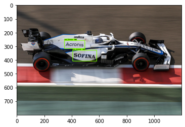
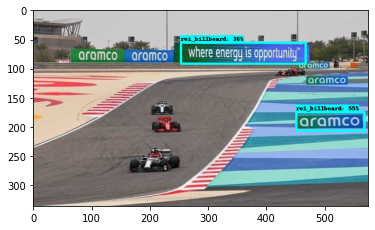
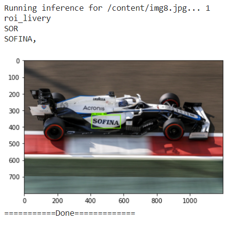
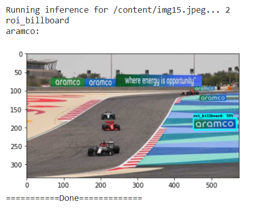

# OCR of Formula 1 Car Liveries and Billboards

A huge part of formula 1 is the advertizing through racetrack billboards and car liveries. I am interested in the 'visual value' of such adverts. The question is, "for a car livery or billboard, how many seconds does it appear in a video stream or clip etc?".

This seems to be a job for object detection and OCR. I attempt to achieve this task using the TensorFlow Object Detection API, OpenCV and PyTesseract.

First, I needed to detect the car livery and billboard in an image, hence the Tensorfloe Object Detection API. It was necessary to retrain an ML model for the specific detection of liveries and billboards. To do this, I collected 100 images of F1 cars and annotated them using labelImg program. These images were then loaded and used to retrain a ResNet50 ML Object Detection Model. The resulting model was tested and shows quite nice results.

 

The regions identified in the model as livery or billboard are then interesting for character recognition. I therefor isolated these regions and performed some filtering to enhance the text in the images using OpenCV.

Once ready, these regions were passed to PyTesseract for OCR. 

 

The results are very interesting, please see the inference images and video!

#### References
https://tensorflow-object-detection-api-tutorial.readthedocs.io/en/latest/training.html

https://medium.com/swlh/tensorflow-2-object-detection-api-with-google-colab-b2af171e81cc
